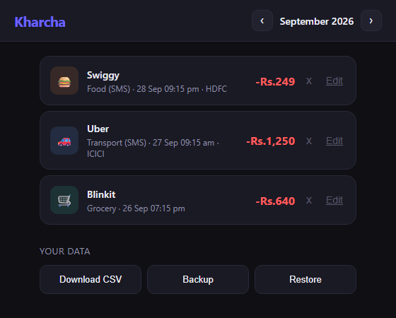

# Export and backup

Kharcha keeps your data on your device only. These three buttons, at the bottom
of the page under "Your data", let you take a copy.

## Where the buttons are

Scroll to the very bottom of the main page, past the transaction list. You will
see the heading **Your data** with three buttons side by side:

On a phone the three buttons sit in one row and wrap to a new line if the
screen is narrow.

## Download CSV

Saves the month you are looking at as a spreadsheet file, for example
`kharcha-2026-09.csv`. Open it in Excel or Google Sheets. Each row has the date,
time, type, amount, merchant, category, bank and where it came from (SMS or
manual).

To export **just one transaction**, tap the transaction to open its details,
then tap **Download** in the detail window. It saves a file such as
`kharcha-transaction-2026-09-12.csv` with the same columns, header plus that one
row.

## Backup

Saves all your months in one file, for example `kharcha-backup-2026-09-30.json`.
Keep it somewhere safe, such as your email or cloud storage. Make a backup
before you clear browser data or change phones.

## Restore

Pick a backup file and Kharcha adds its transactions back. Nothing you already
have is changed or removed, and a transaction that is already saved is not added
twice. Only files made by the Backup button work.

## Good to know

- These buttons work in a web browser and in the installed web app.
- Inside the Kharcha Android app the download may not start yet. Use the web
  app in your phone browser to export until that is added.
